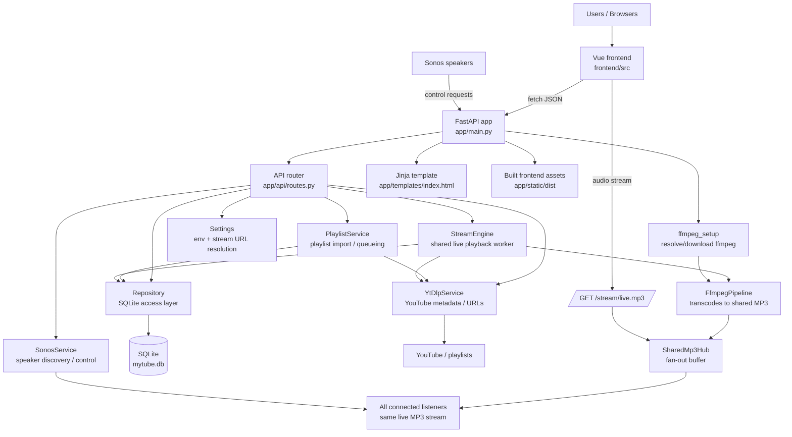

# MyTube Radio

A WSL-friendly FastAPI application that exposes one shared live MP3 stream for all connected clients. Users can queue individual YouTube URLs or playlist URLs into a shared queue.

## Quick Start

1. Install Python 3.10+ and SQLite support.
2. Install dependencies:
   - `python3 -m venv .venv`
   - `source .venv/bin/activate`
   - `python -m pip install --upgrade pip setuptools wheel`
   - `python -m pip install ".[dev]"`
3. Install frontend dependencies and build local Vue assets:
   - `npm install`
   - `npm run build`
4. Install `yt-dlp` binary:
   - `./scripts/setup_yt_dlp.sh`
5. (Optional) install `ffmpeg` manually:
   - `./scripts/setup_ffmpeg.sh`
6. Start the app:
   - `./scripts/run_dev.sh`

Open `http://127.0.0.1:8000`.

## Running Tests

1. Activate your virtual environment:
   - `source .venv/bin/activate`
2. Install dev dependencies if you have not already:
   - `python -m pip install ".[dev]"`
3. Run the test suite:
   - `python -m pytest`
   - Tests default to a 300-second timeout per test.

If `ffmpeg` is missing, the app will try to auto-download a Linux binary from GitHub to `./bin/ffmpeg` at startup.

If the app is running in Docker or otherwise resolves to a non-routable local address for Sonos clients, set `HOST_IP` to the machine IP you want the shared stream URL to use.


## App Structure

### Runtime Architecture



### Directory Map

```text
mytube/
├── app/
│   ├── main.py                    # FastAPI app factory; wires services into app state
│   ├── api/
│   │   └── routes.py              # HTTP routes for queue, playlists, stream, state, Sonos
│   ├── core/
│   │   ├── config.py              # Environment-backed settings and public stream URL logic
│   │   └── logging.py             # Logging configuration
│   ├── db/
│   │   ├── models.py              # SQLAlchemy models: queue, history, playlists, settings
│   │   └── repository.py          # Persistence layer used by routes and services
│   ├── services/
│   │   ├── stream_engine.py       # Background playback loop + shared MP3 publish/subscribe hub
│   │   ├── ffmpeg_pipeline.py     # Launches ffmpeg to convert source media into MP3 chunks
│   │   ├── ffmpeg_setup.py        # Ensures ffmpeg is available, including fallback install path
│   │   ├── yt_dlp_service.py      # Resolves videos/playlists and performs YouTube search
│   │   ├── playlist_service.py    # Playlist preview/import and queue construction helpers
│   │   └── sonos_service.py       # Sonos discovery, grouping, playback, volume control
│   ├── templates/
│   │   └── index.html             # Server-rendered HTML shell
│   └── static/
│       ├── dist/                  # Built Vue assets served by FastAPI
│       ├── css/                   # Legacy/static styles
│       └── js/                    # Legacy/static scripts
├── frontend/
│   ├── src/
│   │   ├── App.vue                # Root Vue component
│   │   ├── components/            # Queue, history, player, Sonos, top bar, sidebar panels
│   │   ├── composables/
│   │   │   └── useApi.js          # Thin fetch wrapper used by Vue components
│   │   ├── main.js                # Vue bootstrap
│   │   ├── router.js              # Frontend router
│   │   └── style.css              # Global frontend styles
│   └── index.html                 # Vite entry for frontend build
├── scripts/
│   ├── run_dev.sh                 # Dev launcher: activates venv, builds frontend if needed, starts uvicorn
│   ├── setup_ffmpeg.sh            # Optional ffmpeg installation helper
│   └── setup_yt_dlp.sh            # yt-dlp installation helper
├── tests/                         # Python unit/integration coverage for API, services, config, DB
├── tests_e2e/                     # Browser smoke test(s)
├── bin/                           # Local tool binaries such as ffmpeg and yt-dlp
├── mytube.db                      # Default SQLite database file
├── pyproject.toml                 # Python package and tool configuration
├── package.json                   # Frontend build dependencies and scripts
└── README.md
```

### How The Pieces Fit Together

1. `uvicorn app.main:create_app --factory` starts the FastAPI app and builds shared singletons for the repository, stream engine, playlist service, Sonos service, yt-dlp service, and ffmpeg pipeline.
2. The Vue frontend calls JSON endpoints in `app/api/routes.py` for queue management, playlist browsing/import, player state, YouTube search, and Sonos control.
3. `PlaylistService` turns a pasted YouTube URL into either one queue item or many playlist-backed queue items, storing metadata in SQLite through `Repository`.
4. `StreamEngine` runs in the background, polls the queue, resolves the next playable media URL with `YtDlpService`, pipes it through `FfmpegPipeline`, and publishes MP3 chunks to every connected listener.
5. `/stream/live.mp3` does not create a separate stream per client; each subscriber receives the same shared live MP3 feed from `SharedMp3Hub`.
6. Sonos endpoints use the same resolved stream URL, so browser clients and Sonos speakers consume the same live output.